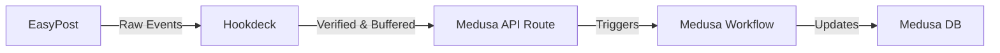

# Inbound Architecture: Shipment Tracking & Event Handling

**Context:** OpticWorks Fulfillment Module
**Status:** Architecture Specification
**Dependencies:** EasyPost, Hookdeck, Infisical, Medusa V2

## 1. Architectural Philosophy
This system is designed to be **event-driven**, **asynchronous**, and **idempotent**.

We do not poll for shipping status. We react to carrier events via a **Push Architecture**. To ensure system stability and security, we utilize **Hookdeck** as a sanitation middleware. The Medusa backend assumes that any request reaching the inbound endpoint is legitimate (verified by Hookdeck signature) but potentially redundant (requires idempotency checks).

## 2. Decision Record: Workflow Orchestration

**Design Pattern:** Medusa V2 Workflows
**Decision:** **MANDATORY**

While simple updates could be handled via service calls, we require a **Medusa Workflow** (`handle-easypost-event`) for inbound processing to ensure:
1.  **Observability:** The ability to trace the execution steps (Parse -> Lookup -> Update) in the Admin dashboard.
2.  **Compensation:** If a step fails (e.g., database lock), the workflow handles the failure state gracefully.
3.  **Extensibility:** Future steps (e.g., "Send SMS Notification") can be injected without refactoring the core logic.

## 3. Security & Environment (Infisical)

**Source of Truth:** All secrets are managed via **Infisical**. The agent must not hardcode keys or rely on local `.env` files outside the Infisical protocol.

### Relevant Keys (Inbound Context)
The agent must ensure the following keys are retrieved from the environment:

| Variable | Source | Purpose |
| :--- | :--- | :--- |
| `HOOKDECK_WEBHOOK_SECRET` | **Infisical** | **CRITICAL.** Used to verify the `x-hookdeck-signature` header. Prevents spoofing. |
| `EASYPOST_MODE` | **Infisical** | Determines logic flow (e.g., handling "Magic" test codes vs real tracking). |
| `EASYPOST_TEST_API_KEY` | **Infisical** | Used if the workflow needs to query EasyPost API for supplementary data in Test Mode. |

*Note: `EASYPOST_WEBHOOK_SECRET` is used by Hookdeck, not Medusa. The agent does not need this key for the inbound backend route.*

## 4. System Actors & Data Flow



1.  **EasyPost:** Emits the "Firehose" of events (granular tracking updates).
2.  **Hookdeck:** Buffers events, handles retries, and signs the payload with our `HOOKDECK_WEBHOOK_SECRET`.
3.  **Medusa API Route:** Acts as the **Gatekeeper**. Validates the Hookdeck signature and passes the payload to the Workflow.
4.  **Medusa Workflow:** Acts as the **Brain**. Executes the State Machine logic.

## 5. Data Protocols (The "Truth")


### A. The Ingress Payload (from Hookdeck)
Hookdeck passes the EasyPost body through. The structure is:

```json
{
  "description": "tracker.updated", // FILTER: Ignore all other descriptions
  "mode": "test",                   // CONTEXT: "test" or "production"
  "result": {
    "tracking_code": "EZ1000...",   // PRIMARY KEY: Lookup Fulfillment by "data.tracking_number"
    "status": "in_transit",         // TRIGGER: Drives the State Machine
    "shipment_id": "shp_123...",    // SECONDARY KEY: Lookup by "data.easypost_shipment_id"
    "carrier": "USPS",
    "public_url": "https://track..."
  }
}
```

### B. Security Protocol
*   **Header:** `x-hookdeck-signature`
*   **Algorithm:** HMAC SHA-256 using `HOOKDECK_WEBHOOK_SECRET`.
*   **Action:** If validation fails, return `401 Unauthorized` immediately.

## 6. Business Logic (State Machine)

The Workflow must map granular EasyPost statuses to Medusa Fulfillment actions.

| Event (`result.status`) | Business Intent | Medusa V2 Workflow Action |
| :--- | :--- | :--- |
| `pre_transit` | Label created. | **No Action.** (Fulfillment exists, but shipment hasn't started). |
| `in_transit` | Carrier has possession. | **Step: Create Shipment.** Moves Order from "Pending" to "Shipped". |
| `out_for_delivery` | Last mile. | **No Action** (Future hook for SMS/Email). |
| `delivered` | Arrived. | **Step: Mark Delivered.** Update fulfillment `data.delivery_status` and `data.delivered_at`. |
| `failure` | Exception. | **Step: Log Error.** |

## 7. Implementation Directives

The agent must reason through the codebase to implement the following:

1.  **Idempotency is Mandatory:**
    *   The Workflow must check if a shipment has *already* been created for a specific fulfillment before creating a new one. `in_transit` events are often sent multiple times.
    *   *Strategy:* Check `fulfillment.shipped_at` before executing `createShipment`.

2.  **Race Condition Handling:**
    *   If `delivered` arrives before `in_transit` (rare but possible in async systems), the Workflow must handle it.
    *   *Strategy:* If status is `delivered` but no shipment exists, the Workflow must execute `Create Shipment` -> `Mark Delivered` sequentially.

3.  **Error Handling Strategy:**
    *   **Fulfillment Not Found:** If the `tracking_code` does not match any fulfillment in the DB, log a warning (`console.warn`) and return `200 OK`.
    *   *Why?* If we return an error, Hookdeck will retry indefinitely, polluting the logs. We only fail on internal system errors, not data mismatches.

4.  **Testing Strategy:**
    *   **Magic Codes:** In `EASYPOST_MODE=test`, standard addresses do not generate tracking events. The implementation must be tested using EasyPost magic codes (e.g., `EZ1000000001`) which automatically cycle statuses.
    *   **Mocking:** For local development, the API route should allow bypassing signature validation if `NODE_ENV=development` and a specific flag is present, to facilitate `curl` testing.
